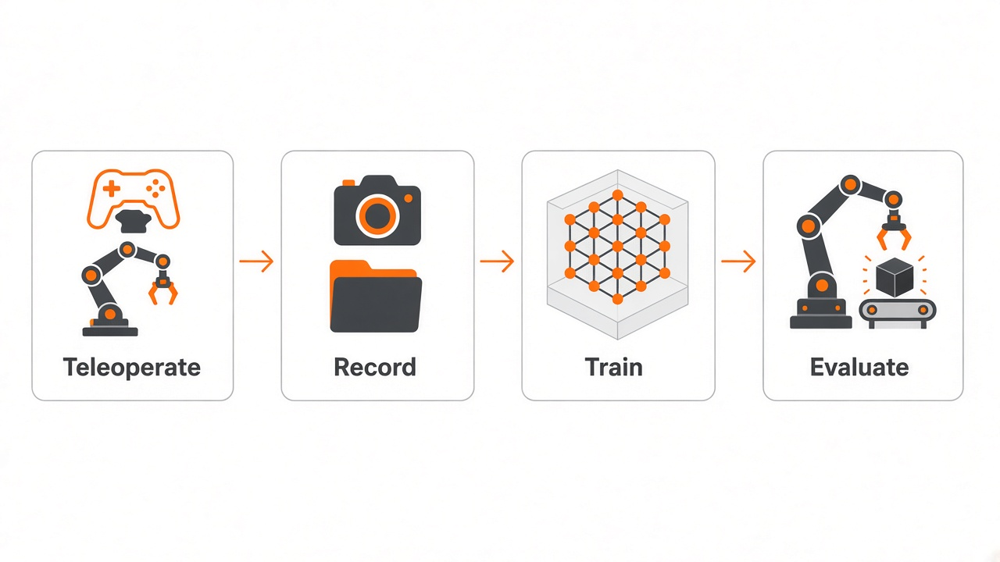
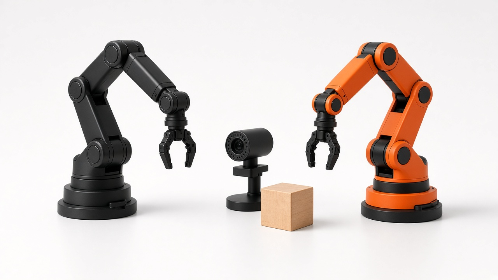
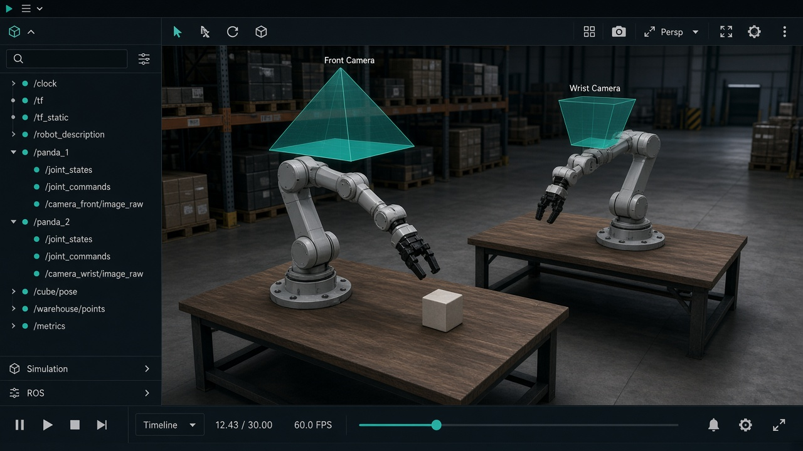

<p align="center">
  
</p>

<div align="center">

# RIA LeRobot

**Piper 실기**와 **Isaac Sim (ROS 2)** 으로 텔레옵 · 수집 · 학습까지

`v0.4.4` &nbsp;·&nbsp; Python `≥ 3.10` &nbsp;·&nbsp; `can_number` / `camera_number` / `<USER>` 만 바꿔 쓰면 됩니다

</div>

<p align="center">
  
</p>

<p align="center">
  
</p>

<p align="center">
  <a href="#설치">설치</a> ·
  <a href="#piper-실기">Piper</a> ·
  <a href="#isaac-sim-ros-2">Isaac</a> ·
  <a href="#데이터-시각화">시각화</a>
</p>

<p align="center">
  Piper:
  <a href="#piper-텔레옵">텔레옵</a> ·
  <a href="#piper-데이터-녹화">녹화</a> ·
  <a href="#piper-에피소드-리플레이">리플레이</a> ·
  <a href="#piper-학습">학습</a> ·
  <a href="#piper-평가">평가</a> ·
  <a href="#piper-평가-녹화">평가 녹화</a>
</p>

<p align="center">
  Isaac:
  <a href="#isaac-텔레옵">텔레옵</a> ·
  <a href="#isaac-데이터-녹화">녹화</a> ·
  <a href="#isaac-에피소드-리플레이">리플레이</a> ·
  <a href="#isaac-학습">학습</a> ·
  <a href="#isaac-평가">평가</a> ·
  <a href="#isaac-평가-녹화">평가 녹화</a>
</p>

---

## 설치

환경 구성은 [LeRobot 공식 Installation](https://huggingface.co/docs/lerobot/installation) 과 같습니다.  
최신 공식 문서는 Python 3.12를 쓰기도 하지만, **이 포크는 LeRobot 0.4.4** 이라서 **Python 3.10** 가상환경을 만듭니다.

다른 환경 관리자(`venv`, `uv`)를 쓸 때도 Python `>= 3.10` 과 `ffmpeg`(가능하면 `libsvtav1` 인코더)가 필요합니다.

### 1. Miniforge (conda) 설치

[miniforge](https://conda-forge.org/download/) 를 권장합니다.

```bash
wget "https://github.com/conda-forge/miniforge/releases/latest/download/Miniforge3-$(uname)-$(uname -m).sh"
bash Miniforge3-$(uname)-$(uname -m).sh
```

설치가 끝나면 터미널을 다시 열거나 `source ~/.bashrc` 로 conda를 활성화합니다.

### 2. 가상환경 만들기

```bash
conda create -y -n lerobot python=3.10
conda activate lerobot
```

셸을 새로 열 때마다 `conda activate lerobot` 을 다시 실행합니다.

WSL에 설치할 때는 `evdev` 도 넣습니다.

```bash
conda install evdev -c conda-forge
```

### 3. ffmpeg 설치

LeRobot은 기본적으로 TorchCodec으로 영상을 디코딩하며, 이를 위해 `ffmpeg` 가 필요합니다.

```bash
conda install ffmpeg -c conda-forge
```

보통 `ffmpeg 7.X` 와 `libsvtav1` 인코더가 같이 들어갑니다. 인코더가 없거나 `torchcodec` 과 버전이 안 맞으면:

```bash
conda install ffmpeg=7.1.1 -c conda-forge
```

지원 인코더는 `ffmpeg -encoders` 로 확인합니다.

### 4. LeRobot과 플러그인 설치

이 저장소를 클론한 뒤, 공식 문서와 같이 editable 모드로 설치합니다.

```bash
git clone https://github.com/acb1015/RIA_lerobot.git
cd RIA_lerobot
conda activate lerobot
pip install -e .
```

텔레옵·녹화·학습에 쓰는 Piper / Isaac 플러그인도 설치합니다.

```bash
pip install -e src/lerobot/robots/lerobot_robot_piper_follower
pip install -e src/lerobot/teleoperators/lerobot_teleoperator_piper_leader
pip install -e src/lerobot/robots/lerobot_robot_isaac_follower
pip install -e src/lerobot/teleoperators/lerobot_teleoperator_isaac_leader
```

Isaac은 ROS 2 토픽을 쓰므로, 시뮬을 돌리기 전에 배포판을 source 합니다. `rclpy` 는 pip이 아니라 ROS 2에서 옵니다.

```bash
source /opt/ros/<distro>/setup.bash
```

### 5. 필요한 라이브러리 (optional extras)

기본 `pip install -e .` 만으로도 텔레옵·녹화·학습 CLI는 동작합니다.  
정책·시뮬·모터 SDK가 더 필요하면 공식 문서처럼 extra를 붙입니다.

```bash
pip install -e ".[smolvla]"     # SmolVLA
pip install -e ".[aloha]"       # gym-aloha 시뮬
pip install -e ".[pusht]"       # gym-pusht 시뮬
pip install -e ".[feetech]"     # Feetech 모터 (SO100/SO101)
pip install -e ".[dynamixel]"   # Dynamixel (Koch)
pip install -e ".[all]"         # 가능한 extra 전부
```

학습 로그를 Weights & Biases에 남기려면:

```bash
wandb login
```

### 문제 해결

빌드 에러가 나면 Linux에서 아래 시스템 패키지를 설치합니다.

```bash
sudo apt-get install cmake build-essential python3-dev pkg-config \
  libavformat-dev libavcodec-dev libavdevice-dev libavutil-dev \
  libswscale-dev libswresample-dev libavfilter-dev
```

설치가 끝나면 `lerobot-info` 로 버전을 확인할 수 있습니다. 이 포크는 `0.4.4` 이어야 합니다.

`--display_data=true` 를 켜면 Rerun 창에서 카메라와 조인트를 실시간으로 볼 수 있습니다.

| 키 | 동작 |
| :---: | --- |
| `→` | 에피소드 종료 후 다음으로 |
| `←` | 방금 에피소드 다시 녹화 |
| `Esc` | 녹화 중단 |

---

## Piper (실기)

<p align="center">
  
</p>

CAN으로 리더/팔로워를 연결하고, OpenCV 카메라로 영상을 받습니다.  
`can_number` 예: `can0`, `can1`. 카메라 번호는 먼저 찾습니다.

```bash
lerobot-find-cameras
```

<p align="center">
  <a href="#piper-텔레옵">텔레옵</a> ·
  <a href="#piper-데이터-녹화">녹화</a> ·
  <a href="#piper-에피소드-리플레이">리플레이</a> ·
  <a href="#piper-학습">학습</a> ·
  <a href="#piper-평가">평가</a> ·
  <a href="#piper-평가-녹화">평가 녹화</a>
</p>

### Piper 텔레옵

리더를 움직이면 팔로워가 따라 가고, Rerun에서 카메라/조인트를 확인합니다.

```bash
lerobot-teleoperate \
  --robot.type=piper_follower \
  --robot.port=can_number \
  --teleop.type=piper_leader \
  --teleop.port=can_number \
  --robot.cameras="{ front: {type: opencv, index_or_path: camera_number, width: 640, height: 480, fps: 30}, top: {type: opencv, index_or_path: camera_number, width: 640, height: 480, fps: 30}}" \
  --display_data=true
```

### Piper 데이터 녹화

텔레옵으로 에피소드를 저장합니다. Hub에 올리지 않으려면 `--dataset.push_to_hub=false` 를 유지합니다.

```bash
lerobot-record \
  --robot.type=piper_follower \
  --robot.port=can_number \
  --teleop.type=piper_leader \
  --teleop.port=can_number \
  --robot.cameras="{ front: {type: opencv, index_or_path: camera_number, width: 640, height: 480, fps: 30}, top: {type: opencv, index_or_path: camera_number, width: 640, height: 480, fps: 30}}" \
  --display_data=true \
  --dataset.repo_id=<USER>/piper_dataset \
  --dataset.single_task="Pick the cube and place it in the box" \
  --dataset.num_episodes=50 \
  --dataset.episode_time_s=60 \
  --dataset.reset_time_s=10 \
  --dataset.push_to_hub=false
```

<details>
<summary><b>이어서 찍을 때</b></summary>

```bash
lerobot-record \
  --robot.type=piper_follower \
  --robot.port=can_number \
  --teleop.type=piper_leader \
  --teleop.port=can_number \
  --robot.cameras="{ front: {type: opencv, index_or_path: camera_number, width: 640, height: 480, fps: 30}, top: {type: opencv, index_or_path: camera_number, width: 640, height: 480, fps: 30}}" \
  --display_data=true \
  --dataset.repo_id=<USER>/piper_dataset \
  --dataset.single_task="Pick the cube and place it in the box" \
  --dataset.num_episodes=10 \
  --resume=true \
  --dataset.push_to_hub=false
```

</details>

### Piper 에피소드 리플레이

저장된 액션을 팔로워에 다시 보냅니다.

```bash
lerobot-replay \
  --robot.type=piper_follower \
  --robot.port=can_number \
  --dataset.repo_id=<USER>/piper_dataset \
  --dataset.episode=0
```

### Piper 학습

```bash
lerobot-train \
  --dataset.repo_id=<USER>/piper_dataset \
  --policy.type=act \
  --output_dir=outputs/train/act_piper \
  --job_name=act_piper \
  --policy.device=cuda \
  --wandb.enable=false
```

### Piper 평가

학습된 체크포인트로 실기만 돌립니다. 에피소드 파일은 만들지 않습니다.  
시작은 **일시정지**입니다. 장면을 맞춘 뒤 Space로 정책을 시작하고, 다시 Space로 멈춥니다.

| 키 | 동작 |
| :---: | --- |
| Space | 일시정지 ↔ 재개 (재개 시 정책 액션 큐를 리셋) |
| Esc / Ctrl+C | 종료 |

실행 전에 `can_number` 인터페이스가 `UP` 인지 확인합니다. (`bash can_activate.sh can0 1000000`)

```bash
lerobot-evaluate \
  --robot.type=piper_follower \
  --robot.port=can_number \
  --robot.cameras="{ front: {type: opencv, index_or_path: camera_number, width: 640, height: 480, fps: 30}, top: {type: opencv, index_or_path: camera_number, width: 640, height: 480, fps: 30}}" \
  --display_data=true \
  --task="Pick the cube and place it in the box" \
  --policy.path=outputs/train/act_piper/checkpoints/last/pretrained_model
```

바로 움직이게 하려면 `--start_paused=false` 를 붙입니다.  
카메라가 `Timed out waiting for frame` 로 끊기면 각 카메라에 `fourcc: MJPG` 를 넣습니다.

### Piper 평가 녹화

학습된 체크포인트로 실기를 돌리면서 평가 에피소드를 저장합니다.

```bash
lerobot-record \
  --robot.type=piper_follower \
  --robot.port=can_number \
  --robot.cameras="{ front: {type: opencv, index_or_path: camera_number, width: 640, height: 480, fps: 30}, top: {type: opencv, index_or_path: camera_number, width: 640, height: 480, fps: 30}}" \
  --display_data=true \
  --dataset.repo_id=<USER>/eval_piper \
  --dataset.single_task="Pick the cube and place it in the box" \
  --dataset.num_episodes=10 \
  --dataset.push_to_hub=false \
  --policy.path=outputs/train/act_piper/checkpoints/last/pretrained_model
```

---

## Isaac Sim (ROS 2)

<p align="center">
  
</p>

Isaac 쪽 카메라와 조인트는 OpenCV / `--robot.port` 가 아니라 **ROS 2 토픽**으로 들어옵니다.  
토픽 이름은 아래 파일 상단에서만 바꿉니다.

- `src/lerobot/robots/lerobot_robot_isaac_follower/lerobot_robot_isaac_follower/topics.py`
- `src/lerobot/teleoperators/lerobot_teleoperator_isaac_leader/lerobot_teleoperator_isaac_leader/topics.py`

실행 전에 ROS 2를 source 하고, Isaac Sim에서 아래 토픽이 나와야 합니다.

```bash
source /opt/ros/<distro>/setup.bash
```

| 역할 | 토픽 |
| --- | --- |
| follower 조인트 | `/isaac/follower/joint_states` |
| follower 명령 | `/isaac/follower/joint_command` |
| 카메라 `front` / `wrist` | `/isaac/follower/front/rgb`, `/isaac/follower/wrist/rgb` |
| leader 조인트 | `/isaac/leader/joint_states` |

<p align="center">
  <a href="#isaac-텔레옵">텔레옵</a> ·
  <a href="#isaac-데이터-녹화">녹화</a> ·
  <a href="#isaac-에피소드-리플레이">리플레이</a> ·
  <a href="#isaac-학습">학습</a> ·
  <a href="#isaac-평가">평가</a> ·
  <a href="#isaac-평가-녹화">평가 녹화</a>
</p>

### Isaac 텔레옵

Isaac 리더를 움직이면 팔로워가 따라 갑니다. 카메라는 토픽에서 자동으로 붙습니다.

```bash
lerobot-teleoperate \
  --robot.type=isaac_follower \
  --teleop.type=isaac_leader \
  --display_data=true
```

### Isaac 데이터 녹화

```bash
lerobot-record \
  --robot.type=isaac_follower \
  --teleop.type=isaac_leader \
  --display_data=true \
  --dataset.repo_id=<USER>/isaac_dataset \
  --dataset.single_task="Pick the cube and place it in the box" \
  --dataset.num_episodes=50 \
  --dataset.episode_time_s=60 \
  --dataset.reset_time_s=10 \
  --dataset.push_to_hub=false
```

<details>
<summary><b>Isaac이 에피소드 종료/리셋을 토픽으로 알려 주는 수집 모드</b></summary>

```bash
ISAAC_COLLECT=1 lerobot-record \
  --robot.type=isaac_follower \
  --teleop.type=isaac_leader \
  --display_data=true \
  --dataset.repo_id=<USER>/isaac_dataset \
  --dataset.single_task="Pick the cube and place it in the box" \
  --dataset.num_episodes=50 \
  --dataset.push_to_hub=false
```

관련 토픽: `/isaac/env/reset`, `/isaac/env/reset_request`, `/isaac/env/episode_end`, `/isaac/env/episode_start`

</details>

### Isaac 에피소드 리플레이

```bash
lerobot-replay \
  --robot.type=isaac_follower \
  --dataset.repo_id=<USER>/isaac_dataset \
  --dataset.episode=0
```

### Isaac 학습

```bash
lerobot-train \
  --dataset.repo_id=<USER>/isaac_dataset \
  --policy.type=act \
  --output_dir=outputs/train/act_isaac \
  --job_name=act_isaac \
  --policy.device=cuda \
  --wandb.enable=false
```

### Isaac 평가

Isaac에서도 `lerobot-evaluate` 로 데이터 없이 정책만 돌립니다. 조작은 [Piper 평가](#piper-평가)와 같습니다 (Space 일시정지/재개, Esc 종료).

Isaac에서 학습한 모델은 같은 `isaac_follower` 카메라 키(`front`, `wrist`)와 조인트 단위로 평가해야 합니다.  
실기 Piper 체크포인트를 Isaac에, 또는 그 반대로 그대로 넣으면 입력이 맞지 않습니다.

```bash
lerobot-evaluate \
  --robot.type=isaac_follower \
  --display_data=true \
  --task="Pick the cube and place it in the box" \
  --policy.path=outputs/train/act_isaac/checkpoints/last/pretrained_model
```

### Isaac 평가 녹화

학습된 체크포인트로 Isaac을 돌리면서 평가 에피소드를 저장합니다.

```bash
lerobot-record \
  --robot.type=isaac_follower \
  --display_data=true \
  --dataset.repo_id=<USER>/eval_isaac \
  --dataset.single_task="Pick the cube and place it in the box" \
  --dataset.num_episodes=10 \
  --dataset.push_to_hub=false \
  --policy.path=outputs/train/act_isaac/checkpoints/last/pretrained_model
```

---

## 데이터 시각화

로컬에 저장된 에피소드를 Rerun으로 재생합니다.

```bash
# Piper
lerobot-dataset-viz \
  --repo-id <USER>/piper_dataset \
  --episode-index 0

# Isaac
lerobot-dataset-viz \
  --repo-id <USER>/isaac_dataset \
  --episode-index 0
```
